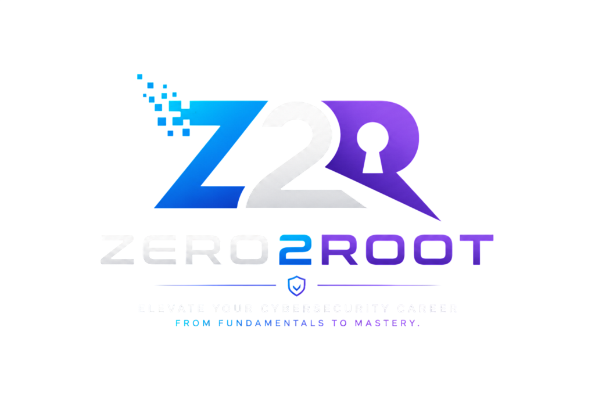

# Zero2Root 🛡️

> Elevate your cybersecurity career — from fundamentals to mastery.

Zero2Root (formerly PentestVault) is a comprehensive, open-source, and free-forever learning platform designed to guide individuals from absolute beginners (Level 0) to Lead Security Architects (Level 4). 

Built with a focus on practical application, Zero2Root provides structured learning paths, tool references, and interview preparation for modern cybersecurity professionals.

<br>
<p align="center">
  
</p>
<br>

## 🚀 Features

* **Structured Learning Paths**: 5 distinct levels of progression (Foundations ➔ Junior ➔ Mid-Level ➔ Senior ➔ Lead/Architect).
* **Interview Q&A Modules**: Dedicated interview preparation sections tailored to each career level.
* **Tools Reference**: Comprehensive guides on Recon, Scanning, Web App, Network, and Mobile pentesting tools.
* **Premium UI/UX**: Built with Material for MkDocs, featuring a responsive, custom glassmorphic dark-mode design.
* **Readability First**: Deep-nested navigation hierarchy and optimized Table of Contents for seamless studying.

## 🛠️ Tech Stack

* **Static Site Generator**: [MkDocs](https://www.mkdocs.org/)
* **Theme**: [Material for MkDocs](https://squidfunk.github.io/mkdocs-material/)
* **Custom Styling**: Vanilla CSS (`docs/assets/stylesheets/extra.css`)
* **Deployment**: Netlify / GitHub Pages

## 💻 Local Development

Want to run Zero2Root on your local machine or contribute to the project? Follow these steps:

### Prerequisites
Make sure you have Python installed on your system.

### 1. Clone the Repository
```bash
git clone https://github.com/Cybertechhacks/Zero2Root.git
cd Zero2Root
```

### 2. Install Dependencies
```bash
pip install -r requirements.txt
```

### 3. Start the Development Server
```bash
python -m mkdocs serve
```
The site will now be available at `http://127.0.0.1:8000`. Any changes you make to the markdown files in the `docs/` folder will automatically reload in your browser!

### 4. Build for Production
To generate the static HTML files (output to the `site/` directory):
```bash
python -m mkdocs build
python remove_duplicate_banner.py
```

## 🤝 Contributing

Zero2Root is open source and community-driven. If you want to add a new tool, fix a typo, or expand a tutorial:
1. Fork the repository.
2. Create your feature branch (`git checkout -b feature/AmazingContent`).
3. Commit your changes (`git commit -m 'Add some AmazingContent'`).
4. Push to the branch (`git push origin feature/AmazingContent`).
5. Open a Pull Request.

## 📄 License

Zero2Root © 2026 — Open Source, Free Forever.
